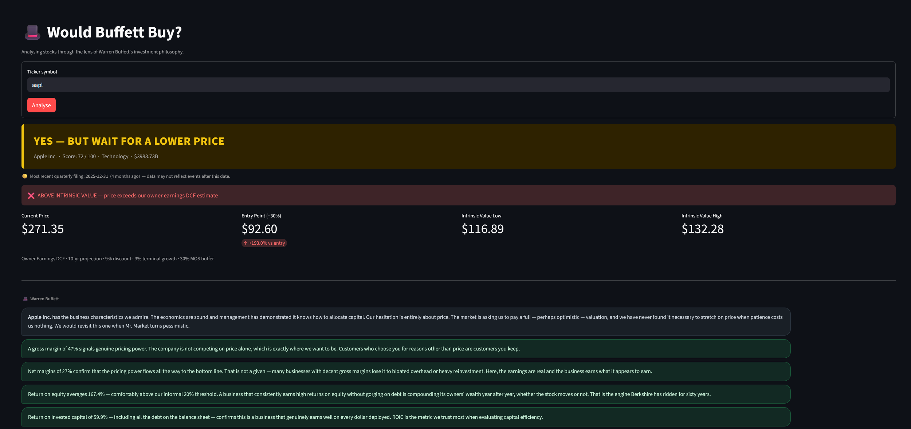

# david-gao-projects-public

A collection of personal projects — data tools, finance analysis, and web experiments.

---

## Projects

### [Buffett Score](buffet_score/)

A stock analyser built around Warren Buffett's investment methodology. Scores any ticker out of 100 across earnings consistency, ROE, ROIC, profit margins, debt, and owner earnings yield. Includes a 10-year DCF intrinsic value estimate and margin of safety analysis.

**Stack:** Python, Streamlit, yfinance

---

### [Fog of Exploration](fog-of-exploration/)

An interactive map that reveals the world as you explore it — locations you've visited light up while everywhere else stays shrouded in fog.

**Stack:** HTML, Leaflet.js

---

## Running locally

Each project has its own setup. See the README inside each folder for instructions.
